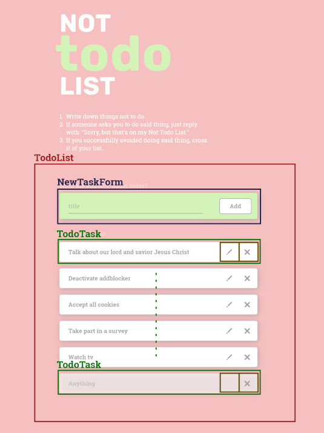

# Architecture

## Components

**component TodoList**

- _function_ addTask(title) _// add a new taks to todoList with the specified title_
- _function_ editTask(id, newTitle) _// set the title of the task with the specified id to newTitle_
- _function_ checkTask(id) _// toggle the checked property of the task with the specified id_
- _function_ deleteTask(id) _// delete the task with the specified id_

- _state:_ taskList: [task: {id: String, title: String, checked: boolean}] _// List of the Todo tasks_
- _state:_ nextId: Number

- **component NewTaskForm**

  - _state:_ newTaskTitle
  - _props:_ id, addTaskHandler=addTask

- **component TodoTask**

  - _state:_ editMode: boolean
  - _props:_ id, title, checkTaskHandler=checkTask, deleteTaskHandler=deleteTask, editTaskHandler=editTask

  - **~~component TaskButton~~**

## Pending issues

- Where to store addTask, editTask, checkTask, deleteTask:

  - In the component TodoList, as described above
  - In a separate js file in the src folder
  - ~~Inside a separate js file for each component~~
